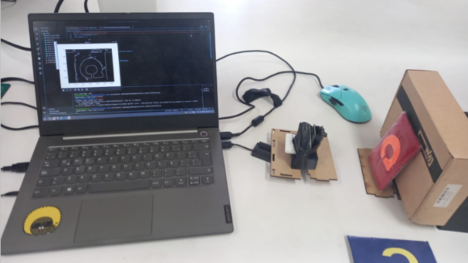

# Tesis-fasciola

## Acerca del proyecto
EL proyecto busca detectar la respuesta colorimétrica a un biomarcador de Fasciola Hepática, mediante técnicas de visión computacional y machine learning.

## Acerca de la Fasciola Hepática
La Fasciola hepatica es un parásito trematodo que infecta principalmente al hígado de diversas especies animales, incluyendo al ser humano. También es conocido como "duelas del hígado" o "duelas del ganado". Este parásito puede producir una enfermedad conocida como fascioliasis, que es una infección parasitaria que puede ser aguda o crónica y que puede afectar la salud del hígado de las personas infectadas. La infección se produce al ingerir plantas o agua contaminada con las formas infectantes del parásito, conocidas como metacercarias. La fascioliasis es más común en zonas rurales de países tropicales y subtropicales donde se practica la cría de animales.

## Problemática
La Fasciola hepática es una enfermedad parasitaria producida por gusanos trematodos que puede infectar tanto a humanos como a animales [1]. Es un problema de salud pública, ya que está vinculada a comunidades de gran pobreza y afecta principalmente a los niños, sobre todo en las zonas endémicas. Según la Organización Mundial de la Salud (OMS), es una de las enfermedades desatendidas [2]. En más de 70 países de todo el mundo, la OMS calcula que al menos 2,4 millones de personas están infectadas [3]. En 17 de los 24 departamentos del país se ha identificado fasciolosis humana [4], siendo las regiones andinas las más afectadas. El 50% de los infectados en el mundo residen en Bolivia, Ecuador y Perú [1].
Tanto para el tratamiento como para la prevención, es crucial un diagnóstico precoz de la presencia de fasciola hepática. En la actualidad, se utiliza la técnica de Kato-Katz [4]  para detectar huevos en las heces, aunque puede proporcionar resultados falsos positivos en la fase aguda y requiere personal altamente cualificado ya que los huevos pueden confundirse con estructuras vegetales presentes normalmente en materia fecal o con otros tipos de huevos provenientes de los trematodos [5][6][7]. En consecuencia, se necesita un método de detección que sea exacto, preciso, no invasivo y rentable para la fasciola hepática.
Se propone un método alternativo para la detección de la fasciola hepática mediante señales voltamperométricas utilizando técnicas de aprendizaje automático y visión computacional. El objetivo es desarrollar un sistema automatizado que pueda identificar la presencia de la fasciola hepática en muestras biológicas de forma efectiva y rentable.

## Bibliografía
[1] Organización Panamericana de la Salud. Organización Mundial de la Salud. Home/Topics/ Fascioliasis. https://www.paho.org/en/topics/ fascioliasis
[2] Organización Mundial de la Salud. Organización Panamericana de la Salud. Acción contra las lombrices. Diciembre 2007; Número 10. https://www.who.int/neglected_diseases/ preventive_chemotherapy/Newsletter10_spa.pdf
[3] Organización Mundial de la Salud. Infecciones por trematodos transmitidos por los alimentos. Fascioliasis. https://www.who.int/foodborne_ trematode_infections/fascioliasis/en/
[4] NTS. N° 148 – MINSA/DGIESP. V 01, R. 266-2019/MINSA. (2019). NORMA TÉCNICA DE SALUD PARA LA VIGILANCIA, PREVENCIÓN Y CONTROL DE LA Fasciolosis Humana en el Perú". http://bvs.minsa.gob.pe/local/MINSA/4022.pdf
[5] Benjamin-Chung, J., Pilotte, N., Ercumen, A., Grant, J. R., Maasch, J. R. M. A., Gonzalez, A. M., Abrams, B. P., Ester, A. C., Arnold, B. F., Rahman, M., Haque, R., Hubbard, A. E., Luby, S. P., Williams, S. A., & Colford, J. M. (n.d.). Comparison of multi-parallel qPCR and Kato-Katz for detection of soil-transmitted helminth infection among children in rural Bangladesh Short title: Comparing qPCR and Kato-Katz for soil-transmitted helminth infection detection. https://doi.org/10.1101/629501
[6] Zárate-Rendón, D. A., Vlaminck, J., Levecke, B., Briones-Montero, A., & Geldhof, P. (2019). Comparison of Kato-Katz Thick Smear, Mini-FLOTAC, and flukefinder for the detection and quantification of fasciola hepatica eggs in artificially spiked human stool. American Journal of Tropical Medicine and Hygiene, 101(1), 59–61. https://doi.org/10.4269/ajtmh.18-0988
[7] Dra María Adela Valero Aleixandre, D., María Dolores Bargues Castelló, D., & Santiago Mas Coma, D. (2017). TESIS DOCTORAL DOCTORADO EN PARASITOLOGÍA HUMANA Y ANIMAL DEPARTAMENT DE FARMÀCIA I TECNOLOGIA FARMACÈUTICA I PARASITOLOGIA FACULTAT DE FARMÀCIA, UNIVERSITAT DE VALÈNCIA, VALENCIA, ESPAÑA CARACTERIZACIÓN FENÉTICA Y GENÉTICA DE INDIVIDUOS DEL GÉNERO FASCIOLA LINNAEUS, 1758 (TREMATODA: FASCIOLIDAE) DE MÉXICO LETICIA CALDERÓN ROMERO FACULTAT DE FARMÀCIA.
